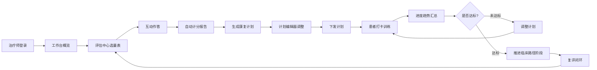

## 1. 产品概述

「康衡 Rehabalance」是一款面向康复医学科的在线评估与训练平台，覆盖肌骨、神经、心肺、儿童发育等康复亚专科，提供分级评估、互动式康复计划、训练进度追踪与个性化临床路径推荐，帮助治疗师与患者实现"评估—计划—执行—复盘"的闭环管理。

- 核心目标：把临床常用的评估量表与循证康复路径整合到一个开箱即用的 Web 平台，降低基层机构开展规范化康复评估的门槛。
- 目标用户：康复治疗师（主用户，负责评估与开方）、患者及家属（执行端，跟随计划训练并上报进度）、机构管理者（查看数据）。
- 价值主张：覆盖全面、即开即用、路径个性化、进度可量化。

## 2. 核心功能

### 2.1 用户角色

| 角色 | 注册方式 | 核心权限 |
|------|----------|----------|
| 治疗师 Therapist | 邮箱注册 + 执业编号（选填） | 创建/管理患者档案、发起评估、开具康复计划、查看全部进度数据、配置临床路径 |
| 患者 Patient | 邀请码 / 邮箱注册 | 完成自评、查看属于自己的康复计划、打卡训练、上报主观感受 |
| 访客 Visitor | 无需注册 | 浏览公开的评估量表说明与科普内容（不可保存数据） |

### 2.2 功能模块

1. **认证与工作台 Auth & Dashboard**：注册/登录、角色切换、个人化工作台概览。
2. **分级评估中心 Assessment Center**：按亚专科（肌骨/神经/心肺/儿童）+ 分级（筛查级 / 进阶级 / 专科级）组织的评估量表库，支持互动式作答与自动计分。
3. **互动式康复计划 Rehab Plan**：基于评估结果生成可编辑的训练计划，含动作库、组数次数、视频占位、提醒节奏。
4. **训练进度追踪 Progress Tracking**：日历打卡、完成率统计、ROM/肌力/疼痛趋势图表、主观 RPE 上报。
5. **个性化临床路径推荐 Clinical Pathway**：根据评估分数与诊断标签，推荐循证临床路径阶段、关键节点与转介建议。
6. **患者档案与数据中心 Profile & Records**：档案管理、历史评估记录、计划归档、导出报告。

### 2.3 页面详情

| 页面名称 | 模块名称 | 功能描述 |
|----------|----------|----------|
| 登录/注册 | 认证表单 | 邮箱+密码登录、注册、角色选择、访客体验入口；localStorage 模拟会话 |
| 工作台 Dashboard | 概览卡 | 今日待办、活跃患者、最近评估、路径推荐提示、快捷操作 |
| 工作台 Dashboard | 数据条 | 本周打卡率、平均完成度、趋势小图 |
| 评估中心 | 亚专科导航 | 肌骨/神经/心肺/儿童 四象限入口，含图标与说明 |
| 评估中心 | 量表库 | 按"筛查—进阶—专科"三级筛选量表卡片，显示条目数、预计时长、适用场景 |
| 评估作答 | 互动作答器 | 单题步进、进度条、上一题/下一题、跳题、自动计分、提交后出报告 |
| 评估报告 | 结果解读 | 总分、分级、维度雷达图、文字解读、跳转"生成计划" |
| 康复计划 | 计划编辑器 | 拖拽动作到日历、设置组数/次数/负荷/备注、视频占位、保存为模板 |
| 康复计划 | 动作库侧栏 | 按部位/目标筛选的动作卡片，含示意占位图与要点 |
| 进度追踪 | 打卡日历 | 月历视图，每日训练状态色块，点击查看详情 |
| 进度追踪 | 趋势图表 | ROM/肌力/疼痛/RPE 多指标折线图，可切换指标与时间窗 |
| 临床路径 | 路径详情 | 阶段时间轴、当前阶段高亮、关键节点、转介提示、关联评估 |
| 临床路径 | 推荐面板 | 基于最新评估的个性化推荐路径卡片与理由 |
| 患者档案 | 档案列表 | 患者卡片、标签筛选、搜索、新建档案 |
| 患者档案 | 档案详情 | 基本信息、诊断标签、评估历史、计划历史、路径状态 |
| 个人中心 | 设置 | 个人信息、角色与执业信息、主题、登出 |

## 3. 核心流程

**主流程：评估 → 计划 → 执行 → 追踪 → 复评**

治疗师登录后进入工作台 → 在评估中心选择亚专科与分级量表 → 完成互动式作答并查看自动计分报告 → 一键"生成康复计划"进入计划编辑器 → 调整动作与参数后下发 → 患者在进度追踪页打卡训练并上报 RPE → 系统汇总趋势 → 触发临床路径阶段推进或转介建议 → 周期性复评闭环。

## 4. 用户界面设计

### 4.1 设计风格

- **设计方向**： refined clinical editorial（精炼临床编辑风）—— 像一本高规格医学期刊与现代数据仪表盘的结合，克制、精密、可信，避开俗套的蓝色医疗配色。
- **主色**：深松石绿 `#0F4C4A`（沉稳、医疗但不俗），辅以暖米色 `#F5F1E8` 背景与近黑 `#1A1A1A` 文字。
- **强调色**：珊瑚橙 `#E8654A`（关键 CTA 与高亮），琥珀 `#D4A24C`（警示/待办）。
- **字体**：标题用衬线显示字体 `Fraunces`（有医学典籍气质），正文用 `IBM Plex Sans`（理性、可读），数据用 `IBM Plex Mono`。
- **按钮**：低圆角（4–6px）、实色填充主按钮、细描边次按钮、悬浮微抬升。
- **布局**：桌面优先，左侧固定主导航 + 顶部上下文栏 + 主内容区卡片栅格；大量留白与细分割线。
- **图标**：线性描边图标（lucide 风格），1.5px 描边，几何感。
- **动效**：页面载入分层渐显（stagger），数字滚动计数，图表绘制动画，卡片悬浮轻位移；克制不喧宾夺主。

### 4.2 页面设计概览

| 页面名称 | 模块名称 | UI 元素 |
|----------|----------|----------|
| 登录/注册 | 认证表单 | 左侧品牌叙事大字+衬线标题，右侧表单卡，分角色 tab，访客入口链接 |
| 工作台 | 概览区 | 顶部问候+日期，四张数据卡（今日待办/活跃患者/本周打卡率/待复评），路径推荐横幅 |
| 评估中心 | 亚专科四象限 | 2×2 大卡片，每卡含插图占位、亚专科名、量表数、进入按钮 |
| 评估中心 | 量表库 | 左侧三级筛选（筛查/进阶/专科），右侧量表卡网格 |
| 评估作答 | 作答器 | 顶部进度条+题号，居中大题干+选项卡，底部上一题/下一题/跳题 |
| 评估报告 | 结果区 | 左侧总分大数字+分级徽章，右侧雷达图，下方维度条+解读+生成计划 CTA |
| 康复计划 | 编辑器 | 中部周日历表（7 列），右侧动作库抽屉，左下参数面板 |
| 进度追踪 | 日历 | 月历主体，色块表状态，侧栏当日详情 |
| 进度追踪 | 趋势图 | 多指标折线图（SVG），指标切换 chips，时间窗选择 |
| 临床路径 | 时间轴 | 纵向阶段时间轴，当前阶段卡放大，节点带图标 |
| 患者档案 | 列表 | 卡片网格，标签 chips，搜索框，新建按钮 |

### 4.3 响应式

- 桌面优先（≥1280px 完整三栏体验），平板（768–1279px）折叠侧栏为图标栏，移动端（<768px）底部 Tab 导航 + 单列堆叠，触摸目标≥44px。

### 4.4 3D 场景

- 不涉及 3D 场景。评估动作示意以插画/SVG 占位呈现。
