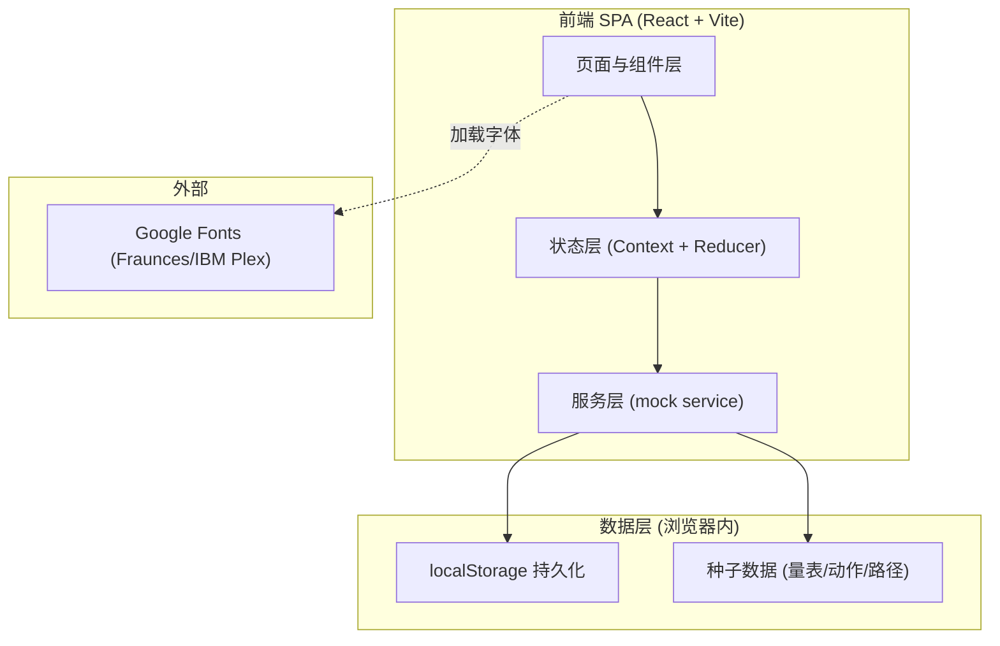
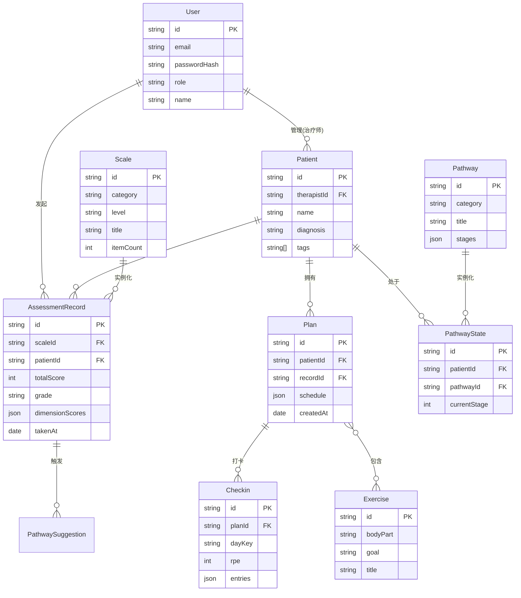

## 1. 架构设计

纯前端 SPA，数据持久化与"会话/认证"全部基于浏览器 localStorage 模拟，无后端服务，开箱即用、零部署依赖。



## 2. 技术说明

- **前端框架**：React 18 + React Router 6
- **构建工具**：Vite 5（`npm create vite@latest`）
- **样式方案**：TailwindCSS 3 + CSS 变量主题
- **图表**：自绘 SVG 折线/雷达图（轻量、可控、无外部图表库依赖）
- **图标**：lucide-react
- **动效**：CSS + 少量 React state 驱动的进入动画
- **后端**：无（mock service 层模拟 API，localStorage 充当数据库）
- **数据库**：localStorage（键名前缀 `rh_`），含用户、档案、评估记录、计划、打卡、路径状态

## 3. 路由定义

| 路由 | 用途 |
|------|------|
| `/login` | 登录/注册页 |
| `/` | 工作台 Dashboard（需登录） |
| `/assess` | 评估中心：亚专科入口 + 量表库 |
| `/assess/:scaleId` | 评估作答页 |
| `/assess/:scaleId/report/:recordId` | 评估报告页 |
| `/plan` | 康复计划：计划列表 + 编辑器 |
| `/plan/:planId` | 计划详情/编辑器 |
| `/progress` | 进度追踪：日历 + 趋势图 |
| `/pathway` | 临床路径：推荐 + 路径详情 |
| `/patients` | 患者档案列表 |
| `/patients/:patientId` | 患者档案详情 |
| `/profile` | 个人中心 |

## 4. API 定义（mock service 层）

```ts
// 认证
auth.register(email, password, role, profile): Promise<User>
auth.login(email, password): Promise<User>
auth.logout(): void
auth.current(): User | null

// 评估
assess.listScales(category?): Scale[]
assess.getScale(id): Scale
assess.submit(scaleId, answers): AssessmentRecord   // 含自动计分
assess.listRecords(patientId?): AssessmentRecord[]

// 计划
plan.generateFrom(recordId): Plan                    // 基于评估生成
plan.list(patientId?): Plan[]
plan.get(id): Plan
plan.update(id, patch): Plan
plan.listExercises(filter?): Exercise[]

// 进度
progress.checkin(planId, dayKey, entries): Checkin
progress.listCheckins(planId, range?): Checkin[]
progress.metrics(patientId, metric, window): Point[]

// 临床路径
pathway.recommend(recordId): PathwaySuggestion[]
pathway.get(id): Pathway
pathway.advance(patientId): PathwayState

// 患者档案
patient.list(): Patient[]
patient.get(id): Patient
patient.create(input): Patient
```

## 5. 服务端架构

无后端。mock service 层位于 `src/services/`，统一返回 Promise，内部读写 localStorage，便于将来替换为真实 API 而不改组件层。

## 6. 数据模型

### 6.1 数据模型定义



### 6.2 数据定义语言（localStorage schema，JSON）

以 JSON 文档存于 localStorage，键名约定：

- `rh_users`：User[]
- `rh_session`：当前登录 userId
- `rh_patients`：Patient[]
- `rh_records`：AssessmentRecord[]
- `rh_plans`：Plan[]
- `rh_checkins`：Checkin[]
- `rh_pathway_states`：PathwayState[]
- `rh_seed_loaded`：种子数据是否已初始化标志

种子数据（首次加载写入）：

- 4 个亚专科分类：肌骨 / 神经 / 心肺 / 儿童发育
- 约 8–10 个评估量表，覆盖三级（筛查/进阶/专科），如：
  - 肌骨：MIF 简版、JOA 腰痛、Constant 肩功能、KOOS 膝
  - 神经：NIHSS、Fugl-Meyer 上肢、Berg 平衡、MMSE
  - 心肺：6MWT、mMRC 呼吸困难
  - 儿童：GMFM 粗大运动
- 约 20+ 训练动作（按部位/目标分类）
- 3–4 条临床路径（如"脑卒中后偏瘫"、"前交叉韧带重建术后"、"下腰痛循证路径"）
- 1 个演示治疗师账号与若干演示患者
